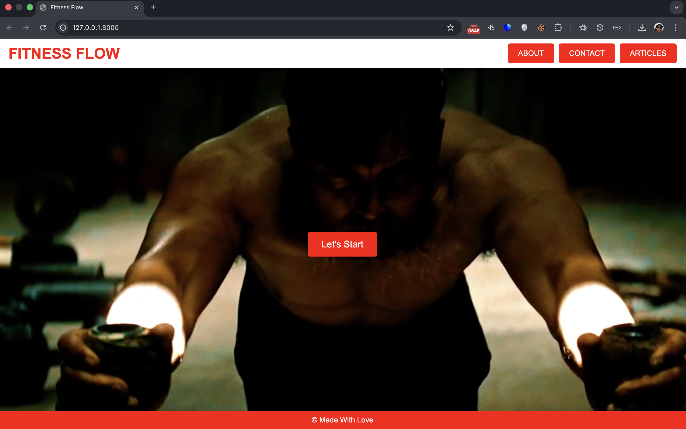
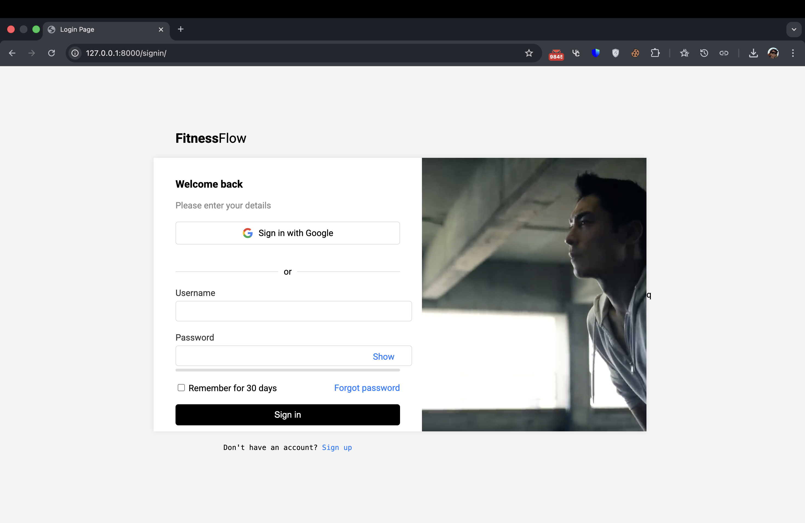
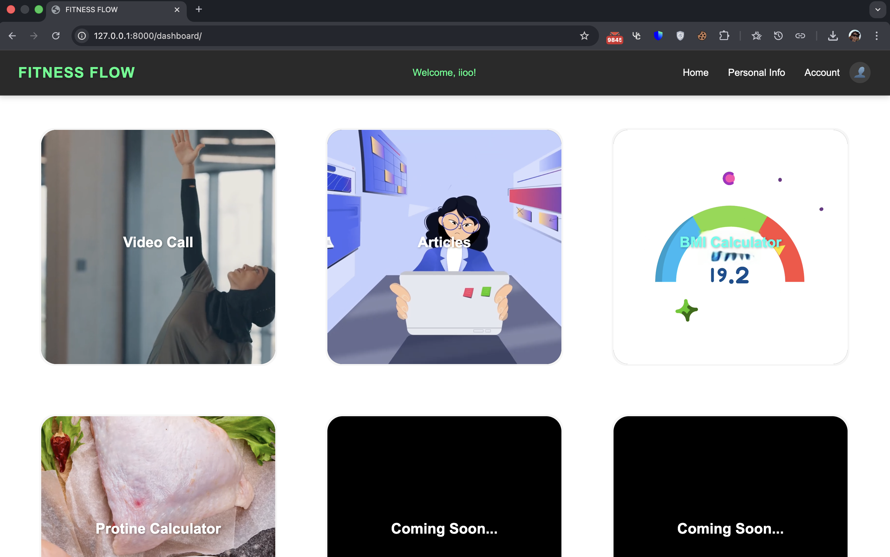
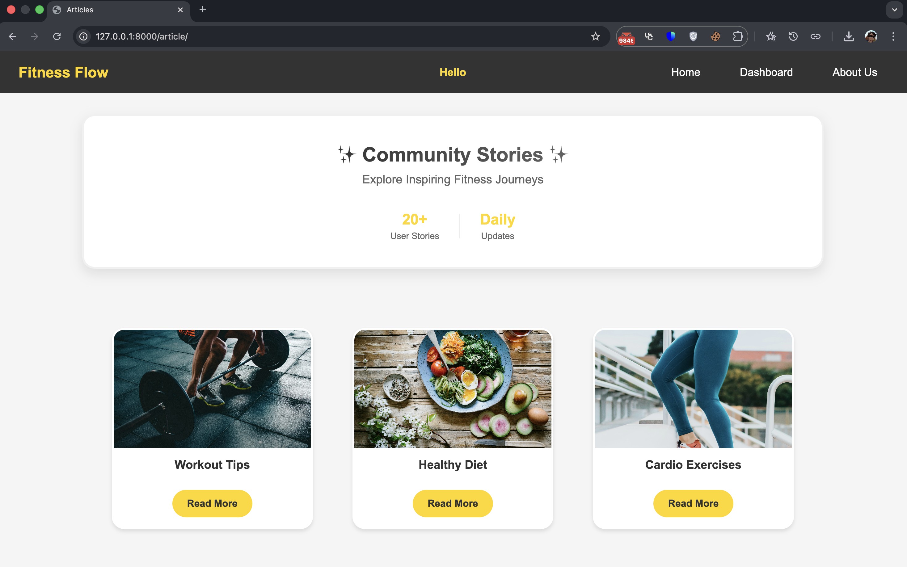

# Fitness Flow

Fitness Flow Is A Beginner Level **Django Project**
I Completed In **My First Year** As Part Of My **DTI Project** <br>
It Is **A Fitness Website** That Connects Users With Trainers Via **Video Calls**, <br>
Includes A **Calorie Tracker**, **Leaderboard**, Blogs, And **Dynamic Data**.  <br>
Though Simple, It Sparked My Interest In Django And Remains One Of My **Favorite Projects XD🩵**
### 📥 **[Download the Project ZIP File](https://drive.google.com/file/d/1pa1p8HkeoDN6easB9MNqq8bjAlw_4uxS/view?usp=drive_link)**

<br>

**FRONT END** <br>


**BACKEND** <br>
 


[](https://choosealicense.com/licenses/mit/)
<br>

###  **[Return To Profile](https://github.com/lunocratic)**

## Screenshots <br><br>

**Home Page**
 <br><br>

**Signin/Signup Page**
 <br><br>

**Dashboard Page**
 <br><br>

**Blogs Page**
 <br><br>


## Project Download

### 📥 **[Download the Project ZIP File](https://drive.google.com/file/d/1pa1p8HkeoDN6easB9MNqq8bjAlw_4uxS/view?usp=drive_link)**


## Setup Instructions

1. **Download** the project ZIP file from the link above.
2. **Unzip** the file and navigate to the project directory.
3. **Install Dependencies**:
    ```bash
    pip install -r requirements.txt
    ```
4. **Set Up the Database**:
    ```bash
    python manage.py migrate
    ```
5. **Run the Server**:
    ```bash
    python manage.py runserver
    ```


